# How it works

Technical documentation for the SPIKE Minecraft Dungeons controller: how a squeeze of a LEGO force sensor ends up as a button press on an Xbox in another room.

For setup and everyday use, see [README.md](README.md).

## Contents

1. [The big picture](#1-the-big-picture)
2. [On the hub: `hub_program.py`](#2-on-the-hub-hub_programpy)
3. [Bluetooth: the SPIKE Prime protocol](#3-bluetooth-the-spike-prime-protocol)
4. [On the Mac: `bridge.py`](#4-on-the-mac-bridgepy)
5. [The game rules: `ControllerLogic`](#5-the-game-rules-controllerlogic)
6. [How Chrome gets gamepads, natively](#6-how-chrome-gets-gamepads-natively)
7. [Our virtual gamepad: `xbox_remote_play.py`](#7-our-virtual-gamepad-xbox_remote_playpy)
8. [From Chrome to the Xbox](#8-from-chrome-to-the-xbox)
9. [One press, end to end](#9-one-press-end-to-end)
10. [Timing](#10-timing)
11. [Limits and gotchas](#11-limits-and-gotchas)
12. [Recording the demo](#12-recording-the-demo)
13. [Adding a new action](#13-adding-a-new-action)

---

## 1. The big picture

There are five stages, each a separate program or device:

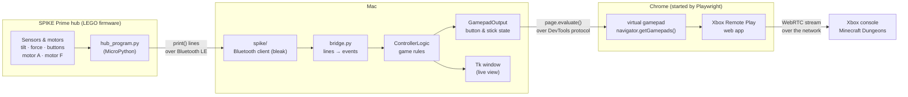

The two design choices that matter most:

- **Each part does the job it's best placed to do.** The hub handles everything physical and time-critical, like driving the trigger back to rest. The Mac handles the game rules, calibration and output. The browser only has to see a controller.
- **The game rules exist once.** `ControllerLogic` is the same code in the simulator, the keyboard mode (`--keys`) and the Xbox mode (`--xbox`). Only its *output* object changes.

## 2. On the hub: `hub_program.py`

The hub runs LEGO's normal firmware, which includes MicroPython. We don't flash anything. `bridge.py` uploads `hub_program.py` into a program slot and starts it, the same way the SPIKE app's ▶ button does.

The program is one loop, every 10 ms (`LOOP_MS`):

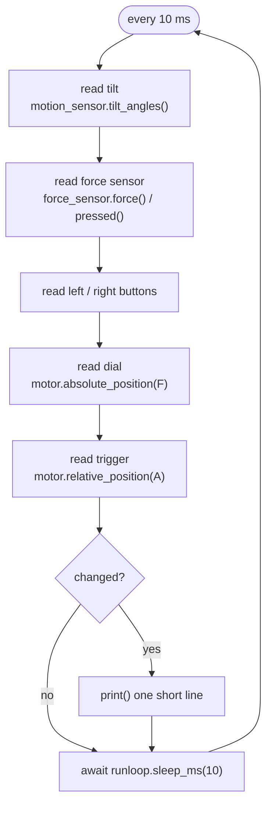

It **only prints when something changes**. That keeps Bluetooth traffic low and makes every line an event. Tilt is also rate-limited to one line per 50 ms (`TILT_EVERY_MS`).

### The line protocol

| Line | Meaning |
|---|---|
| `READY` | program started |
| `T <pitch> <roll>` | hub tilt in whole degrees |
| `F 1` / `F 0` | force sensor pressed / released (≥ 20 % or the click) |
| `P` | force sensor squeezed past 90 % → health potion |
| `B L` / `B R` | left / right hub button pressed |
| `D <angle>` | dial motor F absolute angle, −180…179 |
| `A <angle>` | trigger's distance from its rest angle |
| `TP` / `TR` / `TZ` | trigger pulled / released / back at rest |

Anything else (for example a MicroPython traceback) is printed by the bridge as `hub: …`.

### Why the trigger logic lives on the hub

The trigger is motor A used as a lever. The hub decides "pulled" and "released" itself, then drives the motor back to rest immediately. If the Mac made that decision, the motor would only move after a round trip over Bluetooth.

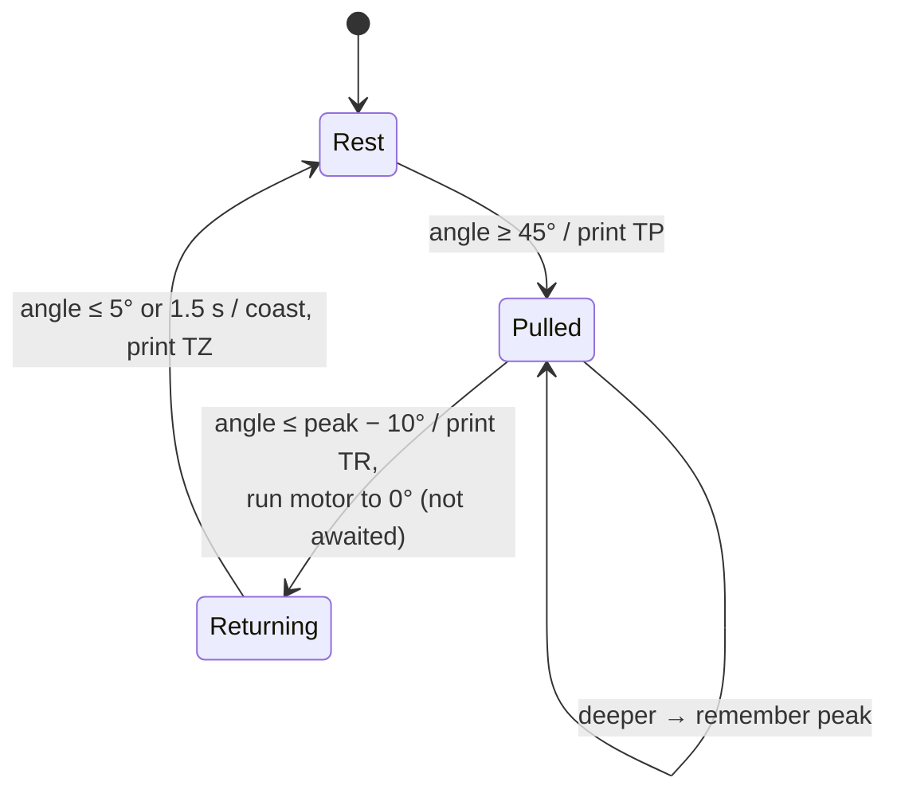

The motor command isn't awaited, so the loop keeps reading sensors while the motor moves. When it arrives, the motor **coasts**, so the lever moves freely again.

The **potion** uses hysteresis. `P` is sent once when force reaches 90 %, and can only be sent again after force drops below 70 %. So one long squeeze never drinks several potions.

## 3. Bluetooth: the SPIKE Prime protocol

The hub speaks LEGO's documented [SPIKE Prime protocol](https://lego.github.io/spike-prime-docs/) over Bluetooth Low Energy. The client in `spike/` comes from the `lego-spike-dino-py` project and uses [`bleak`](https://github.com/hbldh/bleak).

### Transport

| | |
|---|---|
| Service | `0000FD02-0000-1000-8000-00805F9B34FB`, advertised by the hub, which is how we find it |
| RX characteristic `…FD02-0001…` | Mac → hub, *write without response* |
| TX characteristic `…FD02-0002…` | hub → Mac, *notifications* |

### Framing

Every message is framed like this (`spike/protocol.py`):

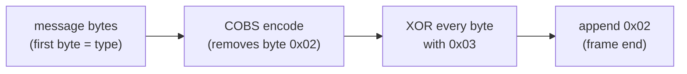

A frame can arrive split across several BLE notifications. `SpikeHub._on_data` buffers bytes until it sees the `0x02` delimiter, then decodes.

### Messages we use

| Message | ID | Used for |
|---|---|---|
| `InfoRequest` → `InfoResponse` | 0x00 / 0x01 | first thing after connecting: gets the max packet and chunk sizes |
| `DeviceNotificationRequest` | 0x28 | turn on (or off) the hub's built-in sensor stream |
| `DeviceNotification` | 0x3C | periodic snapshot of every sensor, used once at startup to find the ports |
| `ClearSlotRequest` | 0x46 | empty the program slot |
| `StartFileUploadRequest` + `TransferChunkRequest` | 0x0C / 0x10 | upload `hub_program.py` in chunks, each with a running CRC32 |
| `ProgramFlowRequest` | 0x1E | start / stop the program |
| `ConsoleNotification` | 0x21 | **everything the hub program `print()`s**: our event channel |

### Startup sequence

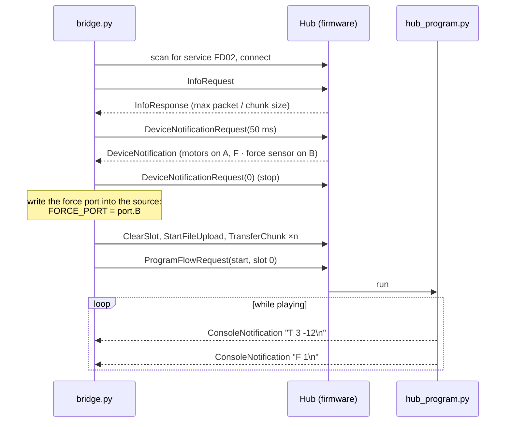

The sensor stream alone isn't enough to play. It doesn't include the hub buttons, and it can't move a motor. That's why a hub program is needed. The stream is still handy for detecting ports before the program starts.

## 4. On the Mac: `bridge.py`

### One loop, no threads

Bluetooth (`bleak`), Chrome control (`playwright`) and the window (`tkinter`) all share **one asyncio loop**, the same idea as `dino.py`:

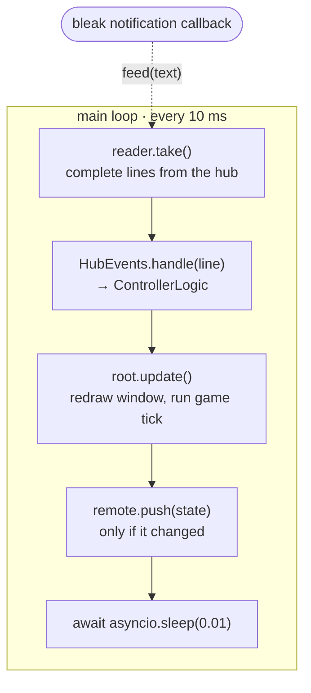

- **`LineReader`**: `ConsoleNotification` text can split a line in two or join several lines. The reader keeps a buffer and hands out only complete lines.
- **`HubEvents`**: turns each line into a `ControllerLogic` call. `F 1` becomes `on_force(True)`, `TP` becomes `trigger_pull()`, and so on.

### Tilt calibration: a 2×2 linear solve

The hub is mounted sideways (like a phone in landscape), and slightly skewed. Tilting "right" changes pitch **and** a bit of roll. Picking one axis per direction made a pure right tilt come out as a diagonal.

So calibration records three readings: level `L`, a full forward tilt `F`, and a full right tilt `R`. Each is a (pitch, roll) pair, and `F` and `R` are stored relative to `L`. For any reading `v` we solve:

```
v − L = right · R + forward · F
```

This is two equations with two unknowns (`tilt_amounts()` in `bridge.py`):

```
det     = R.pitch · F.roll − F.pitch · R.roll
right   = ((v−L).pitch · F.roll − F.pitch · (v−L).roll) / det
forward = (R.pitch · (v−L).roll − (v−L).pitch · R.roll) / det
```

`right = 1.0` means exactly the tilt you made during calibration, which is full speed. Mixed-up axes, reversed signs and a skewed mount all cancel out. Calibration refuses tilts under 5°, or two tilts less than 45° apart, because then `det` is too small to trust.

### Dial

The four calibrated absolute angles (yellow, magenta, green, down) are stored in `calibration.json`. Each `D` reading goes to the nearest one, measured around the circle so that −176° and 179° count as close.

## 5. The game rules: `ControllerLogic`

`controller_simulator.py` holds the rules. They're a small state machine plus an output object:

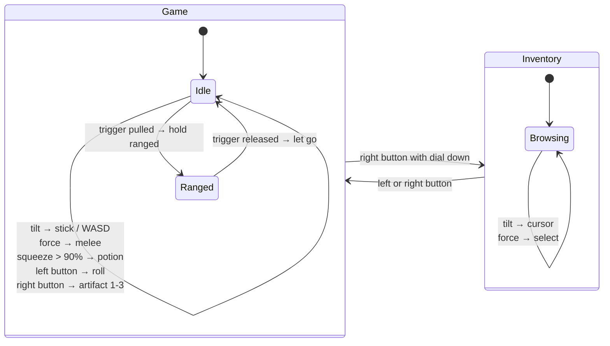

The rules never talk to a device directly. They call a small **output interface**, and each mode plugs in its own:

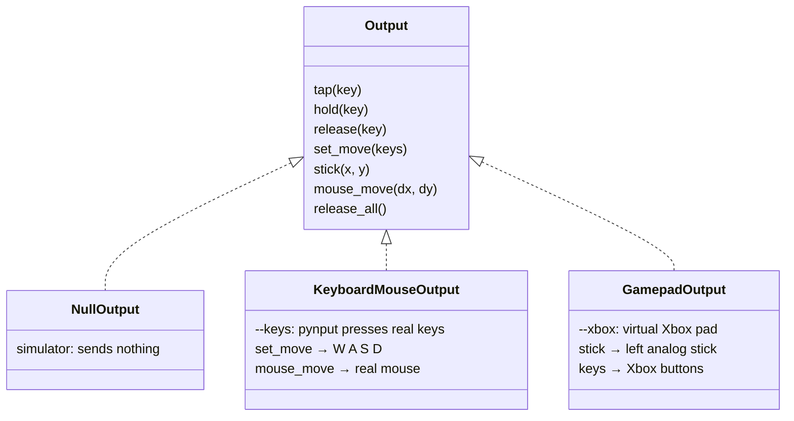

Keys are named the PC way (`"1"`, `"space"`, `"mouse_right"`), and `GamepadOutput` translates them:

| Rules say | PC (`--keys`) | Xbox (`--xbox`) | In Minecraft Dungeons |
|---|---|---|---|
| `stick(x, y)` | (W A S D instead) | left stick | move / inventory cursor |
| `mouse_left` | left click | A | melee / select |
| `mouse_right` held | right button held | RT held | ranged |
| `space` | Space | RB | roll |
| `1` `2` `3` | 1 2 3 | X Y B | artifacts |
| `e` | E | LB | health potion |
| `i` | I | D-pad up | open inventory |
| `esc` | Esc | B | back / close |

## 6. How Chrome gets gamepads, natively

Yes, Chrome supports game controllers natively through the web-standard [Gamepad API](https://w3c.github.io/gamepad/). No extension is needed for a real controller. With a real Xbox controller, the path looks like this:

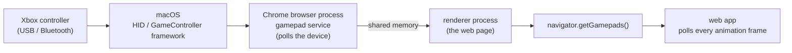

Things worth knowing about the Gamepad API:

- **It's polling, not events.** Apart from `gamepadconnected` / `gamepaddisconnected`, there are no "button pressed" events. The page calls `navigator.getGamepads()`, usually once per animation frame (about every 16 ms), and gets a **snapshot**:

  ```js
  {
    id: "Xbox 360 Controller (XInput STANDARD GAMEPAD)",
    index: 0, connected: true, mapping: "standard",
    timestamp: 123456.7,
    axes:    [leftX, leftY, rightX, rightY],   // -1 … 1, up is -1
    buttons: [{ pressed, touched, value }, …]  // 17 entries
  }
  ```

- **`mapping: "standard"`** means the buttons follow a fixed layout: `0` A, `1` B, `2` X, `3` Y, `4` LB, `5` RB, `6` LT, `7` RT, `8` View, `9` Menu, `10`/`11` stick clicks, `12`–`15` D-pad up/down/left/right, `16` Xbox button.
- **Privacy rules:** Chrome only shows a real controller to a page after a button has been pressed while that page is visible. The page also has to be HTTPS.

## 7. Our virtual gamepad: `xbox_remote_play.py`

There's no real controller in our setup, so we give the page one. The page's JavaScript can't tell the difference, because all it ever does is call `navigator.getGamepads()`.

### Step 1: start Chrome under our control

[Playwright](https://playwright.dev/python/) starts your installed Chrome (`channel="chrome"`) with its own profile folder, so the Microsoft sign-in is remembered. The profile holds cookies and login data, so it lives outside the project (`~/Library/Application Support/lego-spike-game-controller/chrome-profile` on macOS) and can never be committed by accident. Playwright controls Chrome through the **Chrome DevTools Protocol (CDP)** over a private pipe (`--remote-debugging-pipe`), not a network port.

### Step 2: replace `navigator.getGamepads` before the page loads

`context.add_init_script(VIRTUAL_PAD_JS)` becomes CDP's `Page.addScriptToEvaluateOnNewDocument`. Chrome runs our script **in every page and frame, before any of the page's own scripts**. The script:

1. creates a fake gamepad object shaped exactly like the snapshot above (`mapping: "standard"`)
2. replaces `navigator.getGamepads` with a function that returns `[pad, null, null, null]`
3. fires a `gamepadconnected` event, so apps that wait for one notice the pad
4. exposes `window.__spikePad.set(state)`, which rewrites the pad's axes, buttons and timestamp

Because the page's own code runs later, it only ever sees our function. As a side effect, Chrome's "press a button first" privacy rule doesn't apply: the fake pad is visible straight away.

### Step 3: push state from Python

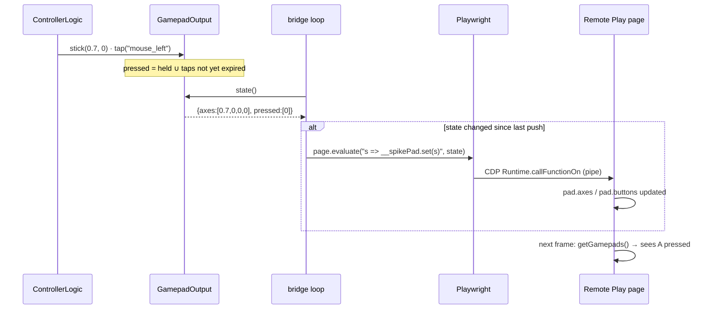

Two details make this reliable:

- **Taps last 100 ms** (`TAP_SECONDS`). The page only looks at the pad about every 16 ms. If a tap were "down" and "up" within the same few milliseconds, the page could miss it completely. So `tap()` keeps the button pressed until a deadline, and `state()` includes every tap that hasn't expired yet.
- **Only changes are sent.** `RemotePlay.push()` compares with the last state it sent, so holding still costs no CDP traffic at all.

### Why not Emux?

[Emux](https://chromewebstore.google.com/detail/emux-virtual-xbox-control/ffmekhedacncololhegkdhnbjoegceng) is a Chrome extension that uses the same trick of replacing the Gamepad API. It fills the pad from **keyboard and mouse** events. That would mean SPIKE → keyboard keys → Emux → gamepad, which loses the analog stick (keys are only on or off) and needs Emux's key mapping set up by hand. Playwright also starts Chrome with `--disable-extensions`, so we write the pad directly instead.

## 8. From Chrome to the Xbox

Xbox Remote Play (`xbox.com/play/consoles`) is a web app that streams from **your own console**:

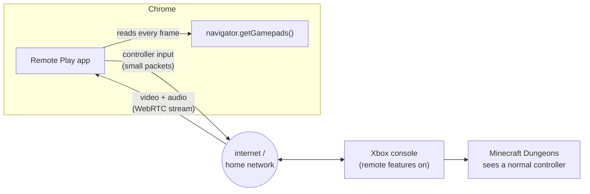

The console runs the game and sends video to the browser. The browser sends controller input back over the same streaming connection, which is built on WebRTC. On the console side, the game sees an ordinary controller, so Minecraft Dungeons needs no changes and knows nothing about LEGO.

## 9. One press, end to end

Squeezing the force sensor hard:

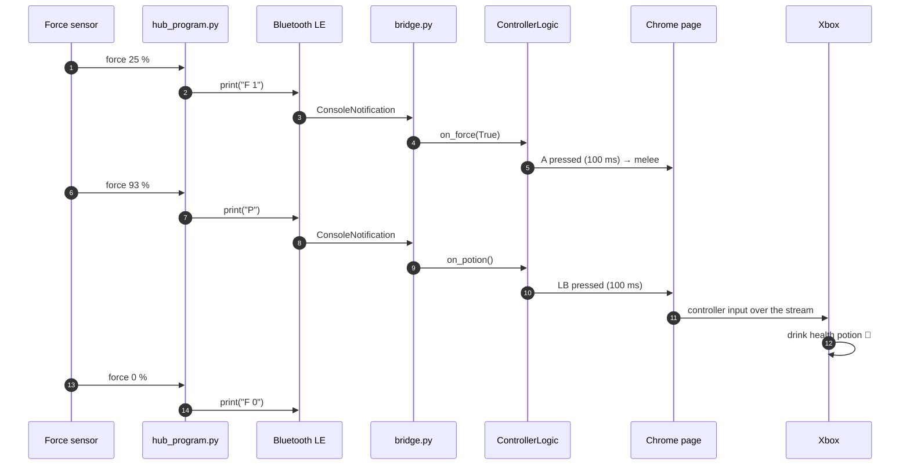

## 10. Timing

These are rough, typical numbers, not measurements:

| Stage | Typical delay | Why |
|---|---|---|
| Hub loop | 0–10 ms | reads sensors every 10 ms |
| Bluetooth LE | ~10–30 ms | notifications go out at the connection interval |
| Bridge loop | 0–10 ms | processes lines every 10 ms |
| Playwright → page | a few ms | one CDP call over a local pipe |
| Page polling | 0–16 ms | Remote Play reads the pad once per frame |
| Stream to Xbox | network dependent | usually tens of ms on a home network |

The largest and least predictable part is the Remote Play stream itself, and it's the same with a real Xbox controller. The trigger's return to rest isn't in this chain at all, because it happens on the hub.

## 11. Limits and gotchas

| Topic | Detail |
|---|---|
| One Bluetooth connection | The hub accepts one host at a time. Close the SPIKE app first, and press the hub's Bluetooth button before each run. |
| macOS permissions | The app running the script needs **Bluetooth** permission, or it crashes with exit code 134. `--keys` also needs **Accessibility**, otherwise macOS silently drops key presses. `--xbox` doesn't need Accessibility. |
| Separate Chrome profile | `~/Library/Application Support/lego-spike-game-controller/chrome-profile` is only for this tool, so you sign in there once. It doesn't touch your normal Chrome. |
| Depends on how Remote Play reads input | If a future version of the Xbox web app stops using `navigator.getGamepads()`, the virtual pad would need updating. |
| Centre hub button | On the LEGO firmware it stops the running program, so it has no game action. |
| Trigger rest angle | Measured when the program starts, so start with the lever at rest. |
| A hard squeeze also melees | The force passes the 20 % "press" level before it reaches 90 %. |

## 12. Recording the demo

`recorder.py` records Remote Play without macOS Screen Recording permission. It asks Chrome itself for frames over the DevTools protocol (`Page.startScreencast`), the same channel Playwright already uses.

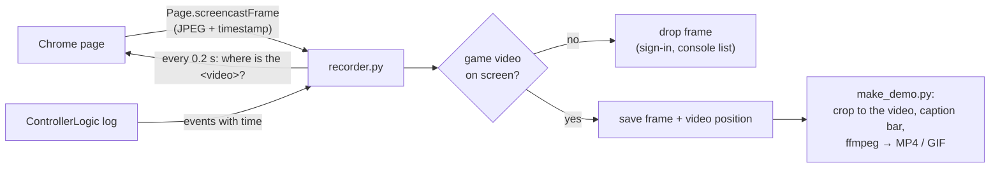

- Each frame is stored with the position of the page's `<video>` element. `make_demo.py` crops to exactly the game picture, removing letterbox bars, so the Chrome page around it, including your account, never ends up in the demo.
- When the page navigates, the video position is cleared immediately, so nothing is saved until a game video appears again.
- Frames arrive when the page repaints, not at a fixed rate. The frame list gives ffmpeg each frame's real duration, and the video is written at a steady 30 fps.
- Captions come from the same `ControllerLogic` log as the window, matched by time. Tilt events only show when nothing else happened, and "trigger returns to rest" is hidden so the bow shot stays visible.
- The game picture can still show gamertags (friends list, main menu), so `make_demo.py` writes a contact sheet to check before publishing.

## 13. Adding a new action

For example, "hold both hub buttons to open the map":

1. **Hub** (`hub_program.py`): detect it and `print("M")`.
2. **Bridge** (`bridge.py`, `HubEvents.handle`): `elif kind == "M": m.on_map()`.
3. **Rules** (`controller_simulator.py`): add `on_map()`, which calls `self.out.tap("m")` and `self.log(...)`, and add a simulator key if you like.
4. **Xbox** (`xbox_remote_play.py`): map it in `GAME_BUTTONS`, for example `"m": "down"` (D-pad down is the map in Minecraft Dungeons).
5. **Docs:** add a row to the tables in `README.md` and here.

## File map

| File | Runs on | Role |
|---|---|---|
| `hub_program.py` | hub | reads sensors, drives the trigger back to rest, prints events |
| `spike/protocol.py` | Mac | SPIKE Prime protocol: framing, CRC, message types |
| `spike/hub.py` | Mac | `SpikeHub`: connect, upload, start/stop, console and sensor stream |
| `bridge.py` | Mac | main program: calibration, lines → events, event loop, `--keys` output |
| `controller_simulator.py` | Mac | `ControllerLogic` (the rules) and the Tk window, also runs standalone |
| `xbox_remote_play.py` | Mac + Chrome | Playwright Chrome, the injected virtual gamepad, `GamepadOutput` |
| `recorder.py` | Mac + Chrome | records the Remote Play game picture through Chrome's screencast |
| `make_demo.py` | Mac | crops, captions and encodes a recording into `docs/demo/demo.mp4` and `docs/images/demo.gif` |
| `calibration.json` | Mac | your tilt and dial calibration |
