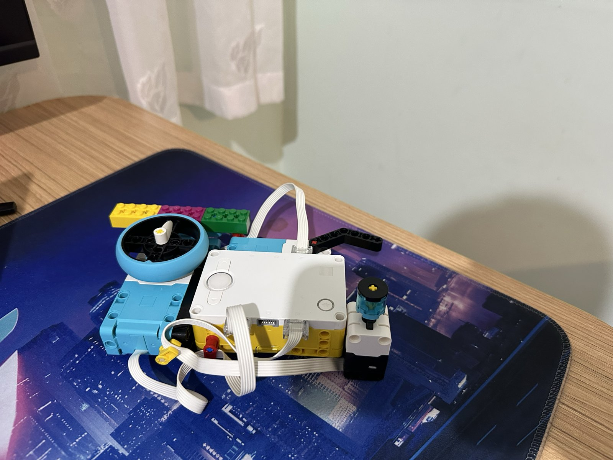
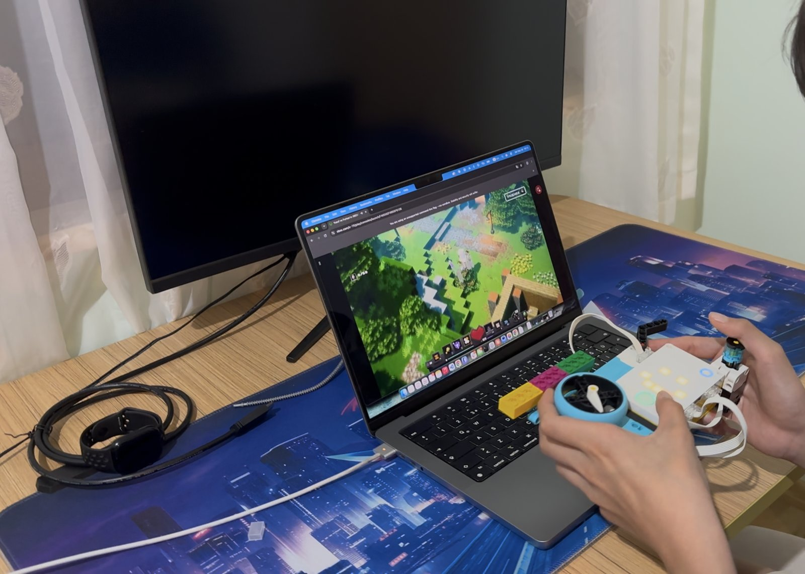
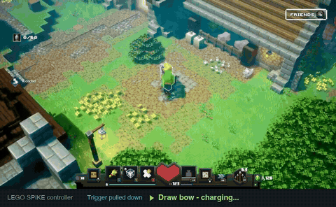
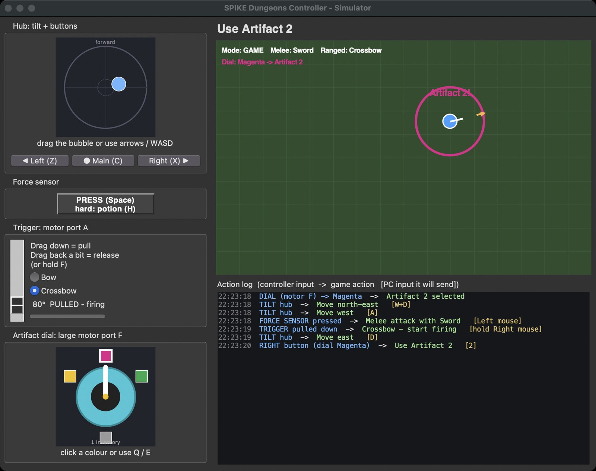
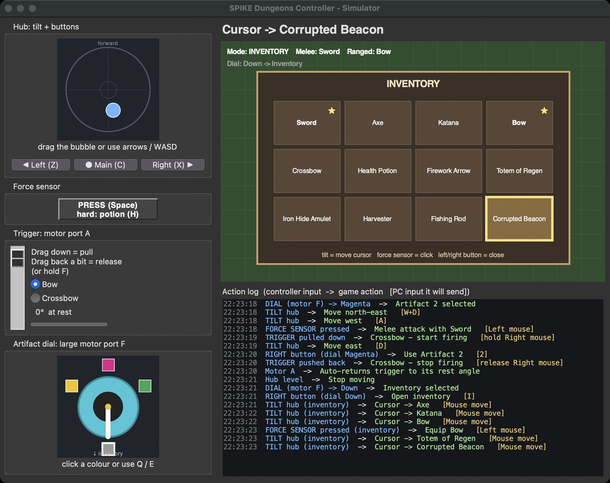

# LEGO SPIKE controller for Minecraft Dungeons

We built this together: [@yusufkeremcakmak](https://github.com/yusufkeremcakmak) designed and built the LEGO controller, and together we wrote the software that turns it into a game controller. It's a LEGO SPIKE Prime hub with a force sensor, a motorised trigger and an artifact dial. It connects to the computer over Bluetooth using the normal LEGO firmware, and plays Minecraft Dungeons on an Xbox through Xbox Remote Play.



*The controller. The hub in the middle is tilted to move and has the left/right buttons. The turquoise dial on the left points at yellow, magenta or green to pick an artifact (large motor, port F). The black lever at the back is the trigger for bows and crossbows (motor, port A). The force sensor with the round cap on the right is for attacking.*



*Playing Minecraft Dungeons on the Xbox, streamed to the MacBook with Xbox Remote Play in Chrome, using only the LEGO controller.*



*Live gameplay through Xbox Remote Play. The bar at the bottom shows what the LEGO controller just did: a fully charged bow shot with the trigger, melee attacks and a health potion with the force sensor, and artifact 2 with the dial and right button. The full 50-second video is [docs/demo/demo.mp4](docs/demo/demo.mp4).*

For how everything works inside (Bluetooth protocol, the virtual gamepad in Chrome, diagrams), see [HOW_IT_WORKS.md](HOW_IT_WORKS.md).

| Program | What it does |
|---|---|
| `controller_simulator.py` | Try the control scheme with keyboard and mouse. No hub needed. |
| `bridge.py` | Connect the real controller. It shows the same window. With `--xbox` it plays on your Xbox through Remote Play; with `--keys` it presses PC keys. |
| `xbox_remote_play.py` | Chrome on Xbox Remote Play with a virtual Xbox controller. `bridge.py --xbox` uses it. |
| `hub_program.py` | Runs **on the hub**. `bridge.py` uploads and starts it for you. |
| `recorder.py`, `make_demo.py` | Record the Remote Play game picture and turn it into the demo video and GIF. |

## Setup

```bash
python3 -m venv .venv
.venv/bin/pip install -r requirements.txt
```

## Controls

| Controller | In the game | In the inventory |
|---|---|---|
| Tilt the hub | Move (W A S D) | Move the cursor (mouse) |
| Force sensor | Melee attack (left mouse) | Click (left mouse) |
| Force sensor squeezed past 90% | Drink a health potion (E) | - |
| Trigger, motor A: pull down | Hold right mouse. A bow charges, a crossbow keeps firing. | - |
| Trigger: push back a bit | Release right mouse. The motor puts the trigger back at rest. | - |
| Dial, motor F | Yellow / magenta / green = artifact 1 / 2 / 3, down = inventory | - |
| Right hub button | Use the artifact (1 2 3), or open the inventory (I) if the dial points down | Close (Esc) |
| Left hub button | Roll (Space) | Close (Esc) |

## Try it without the hub: the simulator

```bash
.venv/bin/python controller_simulator.py
```

The simulator shows what every control does before you connect anything. The left side is a model of the controller, which you can use with the mouse or keyboard. The right side is a small top-down game view, with an action log underneath: each line shows the controller input, the game action, and the PC input it sends. `bridge.py` opens the same window with the real hub, so you can check the controller live.



*In the game: tilting moves the player (the blue bubble shows the tilt), the pulled trigger keeps the crossbow firing, and the right button with the dial on magenta uses artifact 2.*



*With the dial pointing down, the right button opens the inventory. Tilting moves the cursor and the force sensor selects; here it equipped the bow. The left or right button closes it.*

| Keyboard in the simulator | Controller part |
|---|---|
| Arrows / W A S D | tilt the hub |
| Space / H | press / hard-squeeze the force sensor |
| F (hold, then let go) | pull the trigger, then push it back |
| Q / E | turn the artifact dial |
| Z / X / C | left / right / main hub button |

## Playing on your Xbox (from the Mac)

Minecraft Dungeons has no Mac version, so the game runs on the Xbox and the Mac streams it with **Xbox Remote Play** in Chrome (`xbox.com/play/consoles`). The SPIKE controller shows up in that page as a normal Xbox controller. Tilt is a real analog stick, so no keyboard emulator such as Emux is needed.

One-time setup:

1. On the Xbox: **Settings → Devices & connections → Remote features → Enable remote features**, and set power mode to **Sleep** so it can be woken remotely.
2. Sign in to Remote Play once:
   ```bash
   .venv/bin/python xbox_remote_play.py
   ```
   Chrome opens with its own profile, so you stay signed in next time. The profile is stored outside the project in `~/Library/Application Support/lego-spike-game-controller/chrome-profile` because it holds your sign-in. Delete that folder to sign out.

Then play:

```bash
.venv/bin/python bridge.py --xbox
```

Chrome opens on Remote Play. Pick your Xbox, press **Remote play**, and start Minecraft Dungeons. The controller buttons in the game:

| Controller | Xbox button |
|---|---|
| Tilt | Left stick |
| Force sensor | A (melee, or select in the inventory) |
| Force sensor squeezed past 90% | LB (health potion) |
| Trigger pulled | RT held (ranged) |
| Right button + dial yellow / magenta / green | X / Y / B (artifact 1 / 2 / 3) |
| Right button + dial down | D-pad up (inventory) |
| Left button | RB (roll), or B (back) in the inventory |

### Recording a demo

While `bridge.py --xbox` runs, click the controller window and press **R** to start recording, and **R** again to stop. Then:

```bash
.venv/bin/python make_demo.py                                  # newest recording -> docs/demo/demo.mp4 + docs/images/demo.gif
.venv/bin/python make_demo.py --gif-start 27 --gif-end 47      # choose the part of the recording for the GIF
.venv/bin/python make_demo.py --blur 0.02,0.02,0.3,0.08        # blur a region (fractions of the video)
```

It records only the game picture, using Chrome's own screen capture, so macOS Screen Recording permission isn't needed. The Chrome window around the game (with your account) is never recorded, and frames without a game video, such as the sign-in or console pages, are dropped. The game itself can still show gamertags, for example the friends list or the main menu. **Check `contact-sheet.jpg` in the recording folder before publishing**, and trim with `--start`/`--end` or blur with `--blur`. Raw recordings stay in `recordings/`, which git ignores.

## Using the real controller

Before running:

1. Turn on the hub and press its **Bluetooth button** so the light blinks.
2. Close the SPIKE app. The hub accepts **only one connection at a time**.
3. Leave the trigger at its rest angle: that angle is measured when the program starts.

```bash
.venv/bin/python bridge.py --calibrate   # first time only
.venv/bin/python bridge.py               # watch only: nothing is sent to the game
.venv/bin/python bridge.py --xbox        # play on the Xbox through Remote Play (see above)
.venv/bin/python bridge.py --keys        # press real keys and mouse buttons
```

**Calibrating:** hold the controller the way you play. The terminal asks you to hold it level, tilt it forward, and tilt it right, then to turn the dial to each colour. Press the right hub button after each step. The bridge then knows which way is forward however the hub is mounted (flat, or sideways like a phone in landscape). Your level position means standing still, and the tilts you make count as full speed. Everything is saved in `calibration.json`. To redo only one part, run `--calibrate tilt` or `--calibrate dial`.

**With `--keys`:** the game window must be the active window. On macOS, allow your terminal under System Settings → Privacy & Security → **Accessibility**, and the first time, under **Bluetooth** too.

### How it works

```
 Tilt, buttons ─┐
 Force sensor ──┼─ hub_program.py ── print() ── Bluetooth ──▶ bridge.py ──▶ ControllerLogic ──▶ keys / mouse
 Motors A, F ───┘   (on the hub)                              (reads lines)   (same rules as     + simulator
                                                                              the simulator)      window
```

1. `bridge.py` briefly streams sensor data to find the force sensor's port and check the motors on A and F. Then it uploads `hub_program.py` and starts it.
2. The hub program prints a short line whenever something changes, for example `T 12 -3` (tilt), `F 1` (force), `B R` (button), `D 88` (dial angle), `TP` / `TR` (trigger pulled / released).
3. The hub itself drives the trigger back to rest after a release, so it reacts without a round trip over Bluetooth.
4. `bridge.py` turns each line into a call on `ControllerLogic`. This is the same code the simulator uses, so the window and the game always agree.

The `spike/` package (Bluetooth protocol client) comes from the `lego-spike-dino-py` project. Its protocol code is modified from the SPIKE Prime example by the LEGO Group (Apache 2.0).

## Troubleshooting

| Problem | Fix |
|---|---|
| `No SPIKE hub found` | Wake the hub, press its Bluetooth button, and close the SPIKE app and other scripts. |
| `Check the cables: ...` | The trigger motor must be on A and the dial motor on F. The force sensor can be on any other port. |
| Lines starting with `hub:` | An error from the hub program: the message comes from the hub. |
| Trigger fires too easily or too late | Change `PULL_THRESHOLD` / `RELEASE_DELTA` at the top of `hub_program.py`. |

## Authors

- [@yusufkeremcakmak](https://github.com/yusufkeremcakmak): controller design, LEGO build, control scheme and testing
- [@tahircakmak](https://github.com/tahircakmak): software

## License

MIT, see [LICENSE](LICENSE). `spike/protocol.py` is modified from the LEGO Group's SPIKE Prime protocol example (Apache 2.0); the details are in LICENSE. Not affiliated with the LEGO Group or Microsoft.
