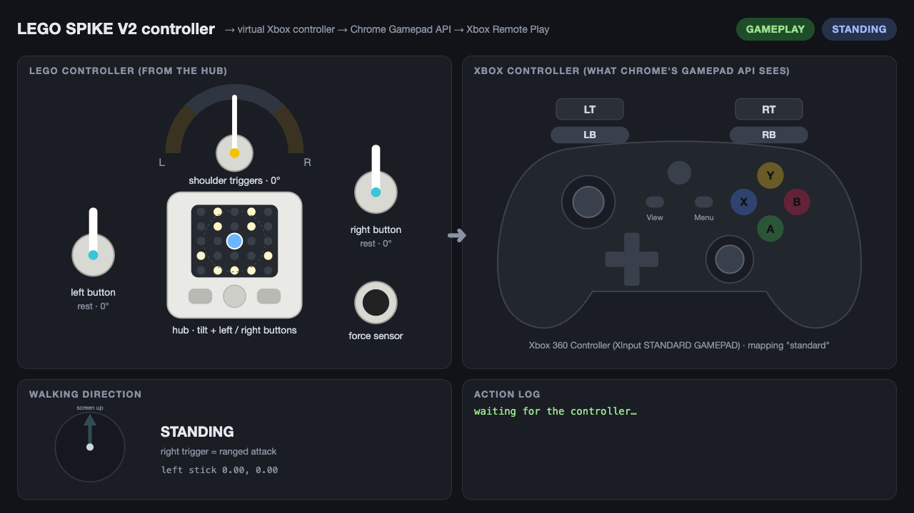
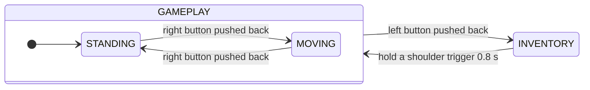
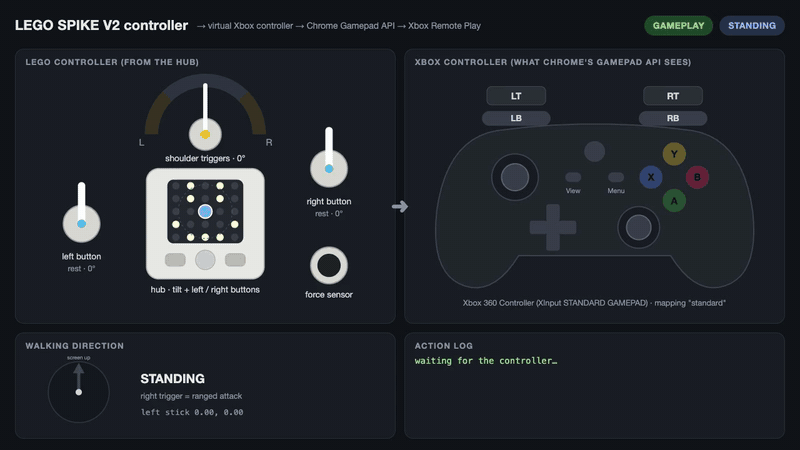
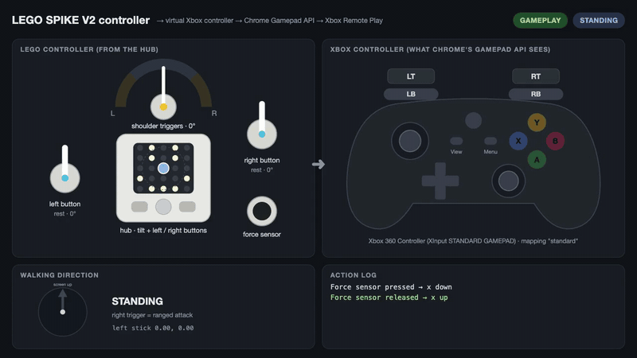
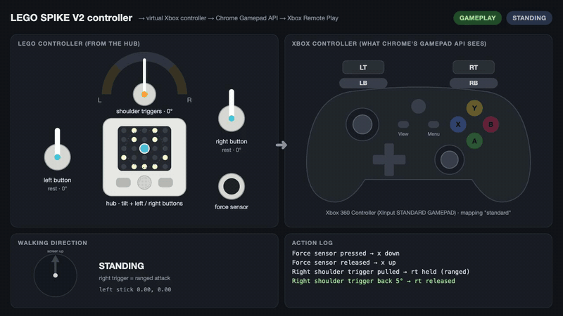
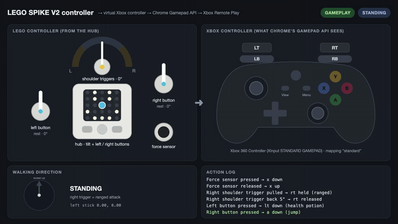
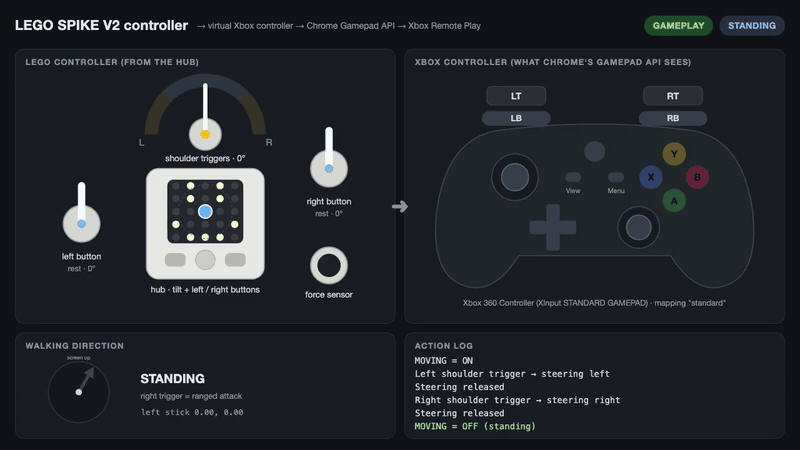
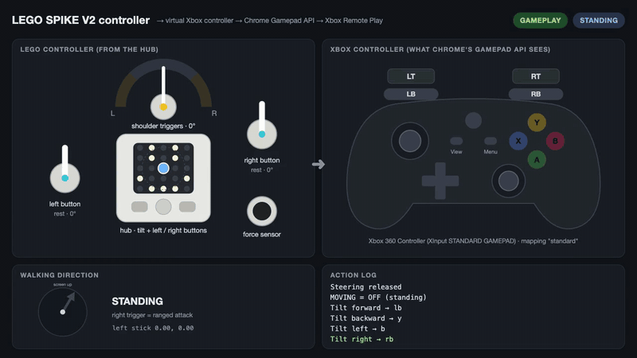
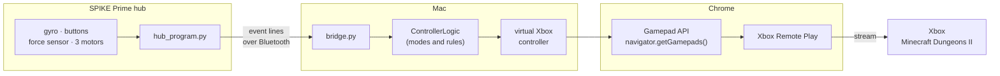

# LEGO SPIKE controller for Minecraft Dungeons II (V2)

> This is the second version of the controller. The first one (tilt to move, an artifact dial and one trigger) is in [`../v1`](../v1/README.md).

We built this together: [@yusufkeremcakmak](https://github.com/yusufkeremcakmak) designed and built the LEGO controller, and together we wrote the software that turns it into a game controller.

The V2 controller is a LEGO SPIKE Prime hub with:
- a force sensor
- two motorised buttons
- two rear shoulder triggers that share one large motor

It talks to the computer over Bluetooth using the normal LEGO firmware, so nothing is flashed or modified. On the computer it shows up in Chrome as an **Xbox controller**, and plays **Minecraft Dungeons II** on an Xbox through **Xbox Remote Play**. No keyboard or mouse emulation is involved: the game sees a controller with real buttons, triggers and an analog stick.



*The dashboard (`bridge.py --tester`) shows the LEGO controller on the left and, on the right, the Xbox controller exactly as Chrome's Gamepad API reports it. Below are the walking direction and a log of every action. The pictures and animations in this README were made with [`make_media.py`](#making-the-readme-pictures). They run the real V2 software in real Chrome, with scripted inputs instead of the hub.*

## Building tutorial

[](https://www.youtube.com/watch?v=_lUhxB4JkKw)

*Building tutorial by [@yusufkeremcakmak](https://github.com/yusufkeremcakmak): [watch it on YouTube](https://www.youtube.com/watch?v=_lUhxB4JkKw).*

For how everything works inside (lever logic, the virtual gamepad in Chrome, the state machine), see [HOW_IT_WORKS.md](HOW_IT_WORKS.md).

| Program | What it does |
|---|---|
| `bridge.py` | **The main program.** It connects to the controller, opens Chrome on Xbox Remote Play with the virtual Xbox controller, and plays. With `--tester` it opens the dashboard instead; with `--record` it also records a demo. |
| `hub_program.py` | Runs **on the hub**. `bridge.py` uploads and starts it for you. |
| `config.py` | Every threshold, timing and Xbox button mapping, in one place. |
| `dashboard.html` | The live dashboard page that `bridge.py --tester` opens. |
| `check_chrome.py` | Checks that Chrome sees the virtual controller. No hub needed. |
| `recorder.py`, `make_demo.py` | Record the game (or the dashboard) and turn it into a demo video and GIF. |
| `make_media.py` | Makes the screenshots and GIFs in this README. |

## Contents

1. [What you need](#what-you-need)
2. [Setup](#setup)
3. [Quick start](#quick-start)
4. [The controller](#the-controller)
5. [Controls](#controls)
6. [Using the real controller](#using-the-real-controller)
7. [Playing on your Xbox](#playing-on-your-xbox)
8. [Recording a demo](#recording-a-demo)
9. [Tuning](#tuning)
10. [How it works](#how-it-works)
11. [Testing](#testing)
12. [Troubleshooting](#troubleshooting)

## What you need

| | |
|---|---|
| **The controller** | The LEGO SPIKE Prime V2 build (see the [building tutorial](https://www.youtube.com/watch?v=_lUhxB4JkKw)): hub, force sensor, 2 small or medium angular motors, 1 large angular motor. |
| **A computer** | A Mac with Bluetooth (developed on macOS; the code is plain Python). |
| **Software** | Python 3.10 or newer, Google Chrome, and for demos [ffmpeg](https://ffmpeg.org) (`brew install ffmpeg`). |
| **To play** | An Xbox with Minecraft Dungeons II and **remote features** turned on (see [Playing on your Xbox](#playing-on-your-xbox)), and a Microsoft account. |

## Setup

V1 and V2 share one Python virtual environment at the root of the repository. From the repository root:

```bash
python3 -m venv .venv
.venv/bin/pip install -r v2/requirements.txt
cd v2
```

That installs [bleak](https://github.com/hbldh/bleak) (Bluetooth), [Playwright](https://playwright.dev/python/) (to start and control Chrome) and [Pillow](https://python-pillow.org) (for demos). Playwright uses the Chrome you already have, so there's no browser to download.

**All commands in this README run from the `v2/` folder.** That's why they start with `../.venv/bin/python`.

The first time `bridge.py` uses Bluetooth, macOS asks whether your terminal may use it: allow it.

## Quick start

1. Turn on the hub, press its **Bluetooth button** (the light blinks), and close the SPIKE app.
2. Leave both motorised buttons and the shoulder triggers **at rest**.
3. Open the dashboard to see the controller working:
   ```bash
   ../.venv/bin/python bridge.py --tester
   ```
   The first time, this calibrates first. Follow the questions in the terminal ([what to expect](#calibrating)).
4. Press things on the controller and watch both sides of the dashboard react.
5. Close Chrome, then play for real:
   ```bash
   ../.venv/bin/python bridge.py
   ```

## The controller

| Part | What it is | What it does |
|---|---|---|
| **Hub** | SPIKE Prime hub with its built-in gyro and left / right buttons | Tilting it in four directions makes four quick actions. The two buttons are map and menu. |
| **Force sensor** | the round push button | Melee attack, for as long as you press it |
| **Left motorised button** | a small or medium angular motor used as a lever | Press: health potion. Push it **backward**: open the inventory. |
| **Right motorised button** | a small or medium angular motor used as a lever | Press: jump. Push it **backward**: start or stop walking. |
| **Shoulder triggers** | **one** large angular motor, geared to both rear triggers | Ranged attack (right trigger) and steering (both) |

**One motor, two triggers.** The two rear triggers are geared to the same large motor. Pulling the **left** trigger turns the motor one way, and pulling the **right** trigger turns it the other way. So the software reads one angle: positive is the right trigger, negative is the left one. Calibration tells it which way is which. The motor also pushes the triggers: back to rest after a ranged shot, and like a spring the rest of the time (see [Moving](#moving-and-steering)).

**Motorised buttons.** They're angular motors, so they know their exact angle. A small press counts as a normal press. Pushing the lever the other way past the rest position is the "backward" action. After you let go, the motor puts the button back at rest.

The **ports don't matter**: `bridge.py` finds the force sensor, the large motor and the two button motors by themselves. The **centre hub button** stops the program (that's the LEGO firmware), so it isn't used in the game.

## Controls

### Two modes

The controller is always in one of two modes. In the game there are two more states:



- **GAMEPLAY / STANDING** is where you start. You stand still, and the right trigger is your **ranged attack**.
- **GAMEPLAY / MOVING**: your player walks by themselves, and you **steer** with the shoulder triggers.
- **INVENTORY**: the controls move through your inventory instead.

The current mode is always shown in the terminal and on the dashboard.

### All controls

| Controller | In the game | In the inventory |
|---|---|---|
| Tilt the hub **forward** | Roll / dodge (LB) | Y |
| Tilt the hub **backward** | Y | - |
| Tilt the hub **left** | B | X |
| Tilt the hub **right** | RB | B |
| **Force sensor** | Melee (X), held while you press | Select (A), held while you press |
| **Left motorised button**: press | Health potion (LT) | - |
| **Left motorised button**: push back | Open the inventory (D-pad up) | - |
| **Right motorised button**: press | Jump (A) | - |
| **Right motorised button**: push back | Start / stop walking (MOVING on / off) | - |
| **Left shoulder trigger** | MOVING: steer left | Slot left (D-pad left) |
| **Right shoulder trigger** | STANDING: ranged attack (RT, held). MOVING: steer right | Slot right (D-pad right) |
| **Hold either shoulder trigger 0.8 s** | - | Close the inventory (B) |
| **Left hub button** | Map (View) | Slot up (D-pad up) |
| **Right hub button** | Menu | Slot down (D-pad down) |

The Xbox buttons are the Minecraft Dungeons II defaults from the [dungeons2.wiki controls guide](https://dungeons2.wiki/guides/controls/), which says the final bindings weren't confirmed yet. Roll is this controller's own mapping on LB. If something does the wrong thing in your game, change it in [`config.py`](#tuning).

### Melee: the force sensor



Press the force sensor and **X goes down. It stays down for as long as you press**, then comes back up when you let go. It's a real held button, so holding it keeps attacking, the same as holding X on a normal controller. It never repeats or flickers: it presses at a force of 10 and only lets go below 5.

### Ranged attack: the right shoulder trigger



While **standing**:

1. **Pull the right trigger** (past 20°): RT goes down, and the bow draws or the crossbow fires.
2. **Keep it pulled**: RT stays held for as long as you like. The trigger stays where you leave it: there's no spring during a ranged attack.
3. **Ease it back about 5°**: RT is released and the shot goes off. The motor then drives the trigger back to rest by itself.

Small wobbles never release it by accident: it only lets go once the trigger has moved 5° back from the deepest point you pulled it to.

### Potion and jump: the motorised buttons



A normal press of the **left** button holds **LT** (health potion), and the **right** button holds **A** (jump), until you let go. Each press counts once, and the motor puts the button back at rest afterwards.

### Moving and steering



Minecraft Dungeons II needs a direction to walk in, and V2 has no joystick. Instead it steers like a car:

1. **Push the right motorised button backward**: MOVING = ON, and your player starts walking (up the screen at first).
2. **Hold the left trigger** to turn left, and **the right trigger** to turn right. The walking direction keeps turning while you hold, at 120° per second, so you can reach any direction.
3. **Let go**: you keep walking in the new direction. The motor works like a **spring** and puts the trigger back at rest by itself.
4. **Push the right button backward again** to stop: MOVING = OFF.

The **Walking direction** circle on the dashboard shows where you're heading. While MOVING, the triggers only steer, so you can't fire the bow by accident. Stop walking first.

### Tilt gestures: the gyro



Tilt the whole controller about 20° in a direction for a quick action: **forward = roll (LB)**, **backward = Y**, **left = B**, **right = RB**.

Each tilt fires **once**. Holding the controller tilted doesn't repeat it. Bring it back level, and it can fire again. Quick snap-backs don't fire the opposite direction by mistake.

### Inventory



1. **Push the left motorised button backward**: the inventory opens (a short tap on D-pad up), and the mode changes to INVENTORY.
2. **Move the selected slot**:
   - **hub buttons**: up and down
   - **short pulls on the shoulder triggers**: left and right (the trigger springs back by itself)
3. **Force sensor = A** (select). **Tilts**: forward = Y, left = X, right = B.
4. **Close it**: hold either shoulder trigger for **0.8 seconds**. The inventory closes (B), and you're back in the game, standing still.

While the inventory is open, the game controls are switched off. Anything you were holding is let go when it opens, so nothing leaks from the game into the inventory, or back.

## Using the real controller

### Before every run

1. Turn on the hub and press its **Bluetooth button** so the light blinks.
2. Close the SPIKE app. The hub accepts **only one connection at a time**.
3. Leave both motorised buttons and the shoulder triggers **at rest**. Their position when the program starts counts as 0°.

### Commands

| Command | What it does |
|---|---|
| `../.venv/bin/python bridge.py` | **Play**: Chrome opens on Xbox Remote Play with the controller |
| `../.venv/bin/python bridge.py --tester` | Chrome opens the **dashboard**: the LEGO controller and the Xbox controller side by side, live |
| `../.venv/bin/python bridge.py --no-chrome` | Don't open Chrome; only print what the controller does in the terminal |
| `../.venv/bin/python bridge.py --calibrate` | **Calibrate** again (find the motors and tilt directions), then carry on |
| `../.venv/bin/python bridge.py --record` | Play and **record** the game picture for a demo (with `--tester`: record the dashboard) |
| `../.venv/bin/python bridge.py --name <hub name>` | Only connect to the hub with this Bluetooth name (useful with several hubs) |
| `../.venv/bin/python bridge.py --slot 5` | Use another program slot on the hub (0-19, default 0) |
| `../.venv/bin/python check_chrome.py` | **No hub needed**: check that Chrome's Gamepad API sees every input |
| `../.venv/bin/python check_chrome.py --show` | The same, with the Chrome window visible |
| `../.venv/bin/python make_demo.py` | Turn the newest recording into `docs/demo/demo.mp4` and `docs/images/demo.gif` |
| `../.venv/bin/python make_media.py` | Make this README's screenshots and GIFs again |
| `../.venv/bin/python -m unittest discover -s tests` | Run the tests |

Options can be combined, for example `bridge.py --tester --record` or `bridge.py --calibrate --tester`.

**To stop**, close Chrome or press **Ctrl+C**. The hub's centre button also stops it. When it stops, every virtual button is released, so nothing stays pressed in the game.

### Calibrating

Calibration runs by itself the first time, and again whenever the force sensor or a motor has moved to another port. It takes about a minute:

```
Found force sensor on F, button motors on B and C, large motor on D.
Uploading hub_program.py to slot 0...

Finding the motorised buttons and the shoulder triggers.
  Press the LEFT motorised button normally (not backward)...
    port C, + direction
  Now put it back to rest.
  Press the RIGHT motorised button normally (not backward)...
    port B, - direction
  Now put it back to rest.
  Pull the RIGHT shoulder trigger...
    port D, - direction
  Now put it back to rest.

Calibrating the tilt. Hold the controller the way you play.
  Hold it LEVEL, then press the RIGHT hub button.
  Tilt it FORWARD (away from you) as far as a normal gesture, then press the RIGHT hub button.
  Tilt it to the RIGHT as far as a normal gesture, then press the RIGHT hub button.
    forward 18°, right 33° (gestures fire at 20° / 20°).
Saved to calibration.json.
```

- **The button and trigger steps** find which motor is which, and which way counts as "pressed". You don't need to know the ports.
- **The tilt steps** learn which way is forward and right, however the hub sits in the build. Tilt the way you would in the game.
- The last line compares your tilts with the gesture threshold. In this example the forward tilt (18°) is **smaller** than the 20° a gesture needs, so the forward gesture would be hard to do. Either tilt further, or lower `GYRO_THRESHOLD_DEG["forward"]` in `config.py`.

Everything is saved in `calibration.json`, which git ignores because it belongs to one controller. The two motorised buttons are the same kind of motor, so **swapping their cables isn't noticed: run `--calibrate` after you re-cable.**

### Checking it with the dashboard

```bash
../.venv/bin/python bridge.py --tester
```

This opens the [dashboard](#lego-spike-controller-for-minecraft-dungeons-ii-v2) instead of Remote Play. It's the quickest way to check the controller before playing:

- **Left side**: what the hub reports. The tilt bubble moves, the levers turn with the real motor angles (green = pressed, orange = pushed back), and the force sensor lights up.
- **Right side**: the Xbox controller as Chrome sees it, read from `navigator.getGamepads()`. This is exactly what Remote Play will receive.
- **Bottom**: the walking direction and the last actions.

### Reading the terminal

While it runs, the terminal prints every action, and a status line each time the mode or the pressed buttons change:

```
  Right shoulder trigger pulled -> rt held (ranged)
GAMEPLAY/STANDING  heading     0°  stick +0.00,+0.00  buttons: rt
  Right shoulder trigger back 5° -> rt released
GAMEPLAY/STANDING  heading     0°  stick +0.00,+0.00  buttons: -
  MOVING = ON
GAMEPLAY/MOVING    heading     0°  stick +0.00,-1.00  buttons: -
  Left button back -> dpad_up: INVENTORY
INVENTORY          heading     0°  stick +0.00,+0.00  buttons: dpad_up
```

The status line shows the mode, the walking direction (heading, in degrees clockwise from the top of the screen), the left stick, and every Xbox button that is down.

## Playing on your Xbox

Minecraft Dungeons II runs on the Xbox, and the Mac streams it with **Xbox Remote Play** in Chrome (`xbox.com/play/consoles`). The LEGO controller is the controller in that page.

**One-time setup on the Xbox:** go to **Settings → Devices & connections → Remote features** and turn on **Enable remote features**. Set the power mode to **Sleep** so the Xbox can be woken remotely.

**Then:**

1. Run `../.venv/bin/python bridge.py`. Chrome opens on Remote Play.
2. Sign in with your Microsoft account if asked. Chrome has its own profile for this, so you stay signed in next time.
3. Pick your Xbox, press **Remote play**, and start Minecraft Dungeons II.
4. Play with the LEGO controller.

The profile is stored outside the project, in `~/Library/Application Support/lego-spike-game-controller/chrome-profile`, because it holds your sign-in. It's shared with V1. Delete that folder to sign out.

**Only the Chrome window that `bridge.py` opens** has the LEGO controller. Your normal Chrome windows don't see it.

## Recording a demo

`bridge.py --record` records the game while you play. It uses Chrome's own screen capture, so it needs no macOS Screen Recording permission, and it only keeps the **game picture**. The page around it (with your account) is never recorded, and nothing is saved while the sign-in or console list is on screen.

```bash
../.venv/bin/python bridge.py --record                      # play; recording starts once the game shows
../.venv/bin/python make_demo.py                            # newest recording -> docs/demo/demo.mp4 + docs/images/demo.gif
../.venv/bin/python make_demo.py --gif-start 20 --gif-end 32  # choose the part for the GIF
../.venv/bin/python make_demo.py --blur 0.02,0.02,0.3,0.08    # blur a region (fractions of the video)
../.venv/bin/python make_demo.py --start 5 --end 60          # trim the video
```

- **Captions:** the demo gets a caption bar that shows what the LEGO controller just did, for example *Right shoulder trigger pulled → rt held (ranged)*.
- **Recording the dashboard:** use `bridge.py --tester --record`, then `make_demo.py --no-captions`. The dashboard already shows every action.
- **Before you publish:** the game itself can still show gamertags, for example the friends list or the main menu. **Check `contact-sheet.jpg` in the recording folder**, and trim with `--start` / `--end` or blur with `--blur`. Raw recordings stay in `recordings/`, which git ignores.

### Making the README pictures

```bash
../.venv/bin/python make_media.py          # -> docs/images/v2-*.png, v2-*.gif and docs/demo/v2-tour.mp4
../.venv/bin/python make_media.py --show   # watch it happen in a visible Chrome window
```

This plays scripted scenes through the **real V2 software**: press the force sensor, pull the right trigger, steer, open the inventory, and so on.

- The hub program's own lever logic turns scripted motor angles into the same events the hub would send.
- The controller rules turn those events into Xbox buttons.
- The dashboard shows the result in real Chrome, and the recorder and `make_demo.py` cut it into GIFs.

So every picture shows what the software really does for those inputs. The full run is also saved as a video: [docs/demo/v2-tour.mp4](docs/demo/v2-tour.mp4).

## Tuning

Everything is in [`config.py`](config.py), with a comment on every value. **Restart `bridge.py` after a change**: it uploads the new values to the hub.

| Setting | Default | What it does |
|---|---|---|
| `GYRO_THRESHOLD_DEG` | 20° each way | how far to tilt for a gesture (one value per direction) |
| `GYRO_DEADZONE_DEG` | 8° | how close to level counts as "back to neutral" |
| `GYRO_NEUTRAL_HOLD_S` | 0.12 s | how long to stay level before the next gesture |
| `BUTTON_PRESS_DEG` / `BUTTON_BACK_DEG` | 25° / 25° | how far to press / push back a motorised button |
| `BUTTON_RELEASE_DEG` | 8° | how far a motorised button must come back to count as released |
| `TRIGGER_PULL_DEG` | 20° | how far to pull a shoulder trigger |
| `TRIGGER_RELEASE_DEG` | 5° | how far to ease the trigger back to stop a ranged attack |
| `TRIGGER_SPRING_STRENGTH` / `TRIGGER_SPRING_MAX` | 120 / 4000 | how hard the trigger spring pulls back (motor power runs 0-10000) |
| `TRIGGER_SPRING` | on | turn the trigger spring off completely |
| `STEER_TURN_RATE` | 120°/s | how fast the triggers turn the walking direction |
| `STEER_STYLE` | `"turn"` | `"strafe"` makes the triggers move straight left / right instead of turning |
| `MOVE_SPEED` | 1.0 | how far the stick is pushed while walking (0-1) |
| `INVENTORY_CLOSE_HOLD_S` | 0.8 s | how long to hold a trigger to close the inventory |
| `FORCE_PRESS` / `FORCE_RELEASE` | 10 / 5 | force sensor press / release levels (0-100) |
| `MIN_PRESS_S` | 0.1 s | the shortest press sent to the game, so a quick tap is never missed |
| `GAMEPLAY`, `INVENTORY` | see [Controls](#all-controls) | which Xbox button each input sends |

The Xbox button names are `a b x y lb rb lt rt view menu ls rs dpad_up dpad_down dpad_left dpad_right xbox`. For example, to roll with a right-stick flick instead of LB:

```python
GAMEPLAY = {
    ...
    "gyro_forward": "rs_flick",
```

## How it works



1. **Finding the ports.** `bridge.py` briefly reads the hub's sensor stream to find the force sensor and the motors. It then uploads `hub_program.py`, with the values from `config.py` filled in, and starts it.
2. **The hub reports changes.** The hub program prints a short line whenever something changes, for example:
   - `F 1`: force sensor pressed
   - `M D +`: right trigger pulled
   - `T 12 -3`: tilt
3. **The hub handles the physical work itself:** press and release detection, putting motors back at rest, and the trigger spring. So nothing waits for a round trip over Bluetooth.
4. **The rules turn events into Xbox controls.** `ControllerLogic` turns each line into Xbox buttons and stick positions, following the modes above.
5. **Chrome gets a virtual Xbox controller.** Chrome is started with a virtual Xbox controller in its Gamepad API, and Remote Play reads it like a real one. The Mac can't create a real system-wide virtual controller, because macOS only allows that for apps Apple has approved. So the controller lives inside that Chrome window.

The details are in [HOW_IT_WORKS.md](HOW_IT_WORKS.md).

## Testing

```bash
../.venv/bin/python -m unittest discover -s tests   # the rules, the hub's lever logic, modes, spring, config
../.venv/bin/python check_chrome.py                  # real Chrome: does the Gamepad API see every input?
```

**What has been tested:**
- **Software:** the tests and `check_chrome.py` pass.
- **Remote Play page:** on the real `xbox.com/play` page, `navigator.getGamepads()` returns the virtual controller.
- **Hardware:** calibration ran on the real controller. In a live session, all the inputs above produced the right Xbox buttons in both modes.

**Still to confirm on the real controller:**
- the trigger spring and the hub-timed inventory close (added after that session)
- how Minecraft Dungeons II reacts through Remote Play: roll on LB, inventory navigation with the D-pad, closing with B, map and menu

## Troubleshooting

| Problem | Fix |
|---|---|
| `No SPIKE hub found` | Wake the hub, press its Bluetooth button, and close the SPIKE app and other scripts. |
| `../.venv/bin/python: no such file or directory` | Run the commands from the `v2/` folder (`cd v2`). |
| `Check the cables: ...` | The controller needs 1 force sensor, 2 small or medium angular motors and 1 large angular motor. The message lists what the hub found on each port. |
| Buttons act swapped, or press and back are the wrong way round | Run `--calibrate`, starting with everything at rest. |
| A tilt gesture is hard to do | Calibration prints how far you tilted. Lower that direction in `GYRO_THRESHOLD_DEG`, or tilt further. |
| A tilt fires when you don't mean it | Raise `GYRO_THRESHOLD_DEG` or `GYRO_NEUTRAL_HOLD_S`. |
| A trigger doesn't come back to rest by itself | Raise `TRIGGER_SPRING_STRENGTH` / `TRIGGER_SPRING_MAX`. |
| A trigger is hard to hold | Lower `TRIGGER_SPRING_STRENGTH` / `TRIGGER_SPRING_MAX`. |
| `hub warning: trigger spring off` | The trigger went past 150° with the spring on: the spring may push the wrong way. Check the build, or set `TRIGGER_SPRING = False`. |
| The inventory closes when you only wanted to move a slot | Let go of the trigger sooner, or raise `INVENTORY_CLOSE_HOLD_S`. |
| The terminal says INVENTORY but the game isn't in the inventory | Hold a shoulder trigger for 0.8 s: that closes it in the software and lines the two up again. |
| A button does the wrong thing in the game | Change it in `GAMEPLAY` / `INVENTORY` in `config.py`. |
| Lines starting with `hub:` | An error from the hub program: the message comes from the hub. Every input is released. |
| `Nothing from the hub for 2 s: released everything` | The Bluetooth connection stalled. Everything is let go for safety, and continues when the hub is heard again. |
| The game doesn't react at all | Make sure you're playing in the Chrome window that `bridge.py` opened. Try `bridge.py --tester` to check the controller itself. |

## Authors

- [@yusufkeremcakmak](https://github.com/yusufkeremcakmak): controller design, LEGO build, building tutorial, control scheme and testing
- [@tahircakmak](https://github.com/tahircakmak): software

## License

MIT, see [LICENSE](../LICENSE). `spike/protocol.py` is modified from the LEGO Group's SPIKE Prime protocol example (Apache 2.0); the details are in LICENSE. Not affiliated with the LEGO Group or Microsoft.
